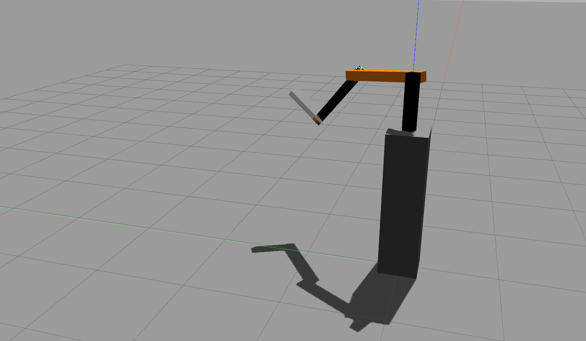
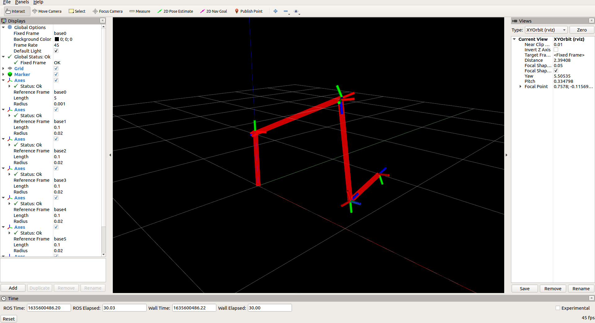

# Axis6

---

6-axis robot simulation in rviz and Gazebo, control implemented with ROS.

- Hand-deduced D-H forward-inverse kinematics implemented in Eigen
- Simulated and visualized in RViz and Gazebo
- ROS implementation (melodic), with key control.

